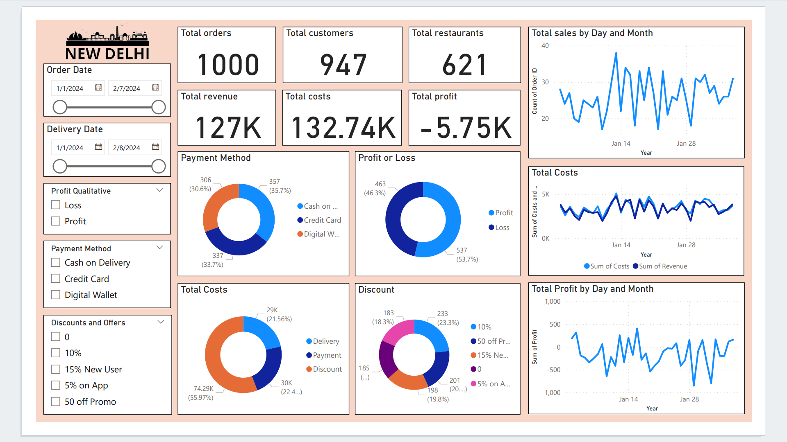

# Food-Delivery-Cost-and-Profitability-Analysis
## Project Overview

This project focuses on analyzing the cost and profitability of food delivery orders. The key aim is to explore patterns related to discounts, delivery costs, and profitability using the provided dataset, especially in terms of identifying profitable and loss-making orders. The project uses various data analysis techniques to gain insights and provide recommendations based on the findings.

### Key Features of the Analysis:
- **Cost & Profitability Analysis**: Analysis of orders classified as profit or loss based on various factors such as discounts, cost of delivery, and delivery times.
- **Exploratory Data Analysis (EDA)**: Visualizations like boxplots and descriptive statistics are employed to understand trends in order costs, discounts, and profitability.
- **Discount Rate Analysis**: Breakdown of the rate of discounts across profitable and loss orders.
- **Data Cleaning**: Handling of missing or incorrect values in the dataset before analysis.
- **Data Visualization**
  
## Folder Structure

```
Food-Delivery-Cost-and-Profitability-Analysis/
│
├── data/
│   └── food_orders_new_delhi.csv 
│   └── food_orders_new_delhi_cleaned.csv
│
├── recap.png
├── eda.ipynb
└── Visualize data.pbix
```

## Setup Instructions

1. **Clone the repository:**
   ```bash
   git clone https://github.com/yourusername/Food-Delivery-Cost-and-Profitability-Analysis.git
   ```

2. **Run the Jupyter notebook:**
   To explore the analysis and reproduce the results, open the `eda.ipynb` notebook using Jupyter:
   ```bash
   jupyter notebook eda.ipynb
   ```

## Dataset
[Case study: Optimizing Cost and Profitability from STATSO](https://statso.io/optimizing-cost-and-profitability-case-study/#google_vignette)

## Analysis and Findings

- **Discount Impact**: The analysis shows that higher discounts often result in loss-making orders, while profitable orders tend to have lower discount rates.
- **Profit vs. Loss Orders**: A detailed comparison of factors between profit and loss orders using descriptive statistics and visualizations (e.g., boxplots).

## Results



## License

This project is licensed under the MIT License - see the [LICENSE](LICENSE) file for details.
